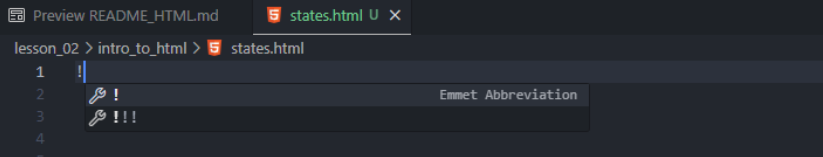

# Introducing HTML

HTML (Hypertext Markup Language) is the foundational language for creating and structuring content on the web. It uses a system of elements (tags) to define the structure and meaning of a webpage's content.

## What is HTML?

`HTML` stands for `Hypertext Markup Language`. It provides the basic structure / skeleton of a webpage and is often used alongside `CSS` ( Cascading Style Sheets) for style and `JavaScript` (for functionality). HTML is essential for building websites, as it:

* Defines the layout and structure of a webpage.
* Embeds content such as text, images, videos, and links.
* Works as the backbone for web development

## Key Concepts

* **Elements**: The building blocks of HTML, defined using tags.
* **Tags**: Keywords surrounded by angle brackets (`<p>` for a paragraph).
* **Attributes**: Additional information about an element (`class="header"`)
* **Hierarchy**: HTML follows a nested structure to organize content.

## Basic Structure of an HTML Document

An HTML Document starts with a `<!DOCTYPE>` declaraction, followed by a structure set of elements:

```html
<!DOCTYPE html>
<html>
<head>
    <title>Page Title</title>
</head>
<body>
    <h1>Welcome to HTML</h1>
    <p>This is a basic HTML document.</p>
</body>
</html>
```

* `<!DOCTYPE html>`: Declares the document type as HTML5.
* `<html>`: The root element containt all other elements.
* `<head>`: Contains metadata, links to stylesheets, and the title.
* `<body>`: Contains the visible content of the webpage.

## HTML Elements

HTML elements consist of:

1. **Opening Tag**: Indicates the start of an element (`<h1>`)

2. **Content**: The information displayed ("Hello, World!")

3. **Closing Tag**: Indicates the end of an element (`</h1>`)

**EXAMPLE**

```html
<h1>Hello, World!</h1>
```

Some tags are also known as self closing tags. These are tags that _DO NOT_ require a closing tab but instead they are written as a single tag ending with a `/` before the closing angle bracket.

**EXAMPLE**

1. Images:
```html

```
2. Break (Line Break):
```html
<br />
```
3. Input (Form Fields):
```html
<input type="text" placeholder="Enter your name" />
```
4. Meta (metadata):
```html
<meta charset="UTF-8">
```


## Commonly Used Tags

Here are some of the most frequently used HTML tags.

* **Headings**: `<h1>` to `<h6>` for different levels of headings. The smaller the number the bigger the text

* **Paragraphs**: `<p>` for text content.

* **Links**: `<a href="https://example.com">`Click here`</a>`

* **Images**: ``

* **Lists**:
    - **Ordered**: `<ol>`
    - **Unordered**: `<ul>`
    - **List items**: `<li>`

* **Divisions**: `<div>` for grouping content.

## Attributes in HTML

Attributes provide additional information about elements. They are written within the opening tag.

**EXAMPLE** 
```html
<a href="https://example.com" target="_blank">Visit Example</a>
```

* **href**: Specifies the URL of the link.

* **target**: Determines how the link opens (`_blank` for a new tab)

## Setting up an HTML document

First and foremost, before we begin there are a couple things that we can to install into our VSCode to make the experience of creating an HTML document a little bit more enjoyable.

1. Navigate to the Toolbar on the left hand side of your VSCode and select `Extensions`

2. Within the `Extensions` marketplace install the following extensions

    - Live Server:
        - Launches a local development server with a live reload feature for static and dynamic pages.
        - Automatically refreshes the browser when you save changes to your HTML, CSS, or JavaScript files.
        - Ideal for quickly testing web development projects
    
    - Prettier:
        - A code formatter that enforces consistent style across your codebase.
        - Automatically formats code upon saving based on defined rules (spacing, indentation, line breaks)
        - Supports various languages like HTML, CSS, JavaScript, Python, etc.
    
    - Quokka:
        - A real-time code runner that evaluates JavaScript or TypeScript code as you type.
        - Shows the output or runtime values of variable directly inside your editor.
        - Useful for debugging and protyping code snippets
    - Rainbow CSV:
        - Enhances working with CSV and TSV files by highlighting columns in different colors.
        - Allows you to easily visualize and manage data within tabular formats.
        - Includes features like query execution with SQL-Like commands.
    - VS Code Icons
        - Adds a collectino of icons to the file explorer in VS Code for better file identification.
        - Displays differnt icons for files based on their type (.html, .css, .js).
        - Makes navigating large projects easier by visually categorizing files.

The extensions are not mandatory but they definitely make writing code easier and alleviates a lot of headache when trying to debug your code.

1. Create a document named states with the suffix of `.html`

    - **EXAMPLE**: `states.html`

2. Within this document type `!`, this will prepopulate the option to auto fill a template boiler plate for an HTML document. Choose the first option.



3. You should now have a boiler plate template for the skeleton of your HTML document. From here you are able to make any changes that you would like

```html
<!DOCTYPE html>
<html lang="en">
<head>
    <meta charset="UTF-8">
    <meta name="viewport" content="width=device-width, initial-scale=1.0">
    <title>Document</title>
</head>
<body>
    
</body>
</html>
```

4. Under the assumption that you have the `Live Server` extension installed we want to right click on our HTML document and select the option of `Open with Live Server`. This will open a window in your browser that represents your current `states.html` document. Using this window, we can see in real time any changes that are being made within our HTML.

## States.html

Within the `<body>` tag lets create a header that will welcome us to our webpage.
```html
<body>
    <h1>Welcome to the State Information Page<h1/>
</body>
```

We will see that within our browser, it will dynamically populate any changes that has been made.

Lets add a Welcome Message by utilizaing the `<p>` tag below the heading with the following message.

```html
<p>I hope everyone is excited to be here. For our HTML demonstration we will be creating a list of States</p>
```

Create a `List of States` and add an `unordered` list of the cities.

```html
<ul>
    <li>Chicago</li>
    <li>Phoenix</li>
    <li>Detroit</li>
    <li>Atlanta</li>
    <li>Los Angeles</li>
    <li>Seattle</li>
    <li>Houston</li>
    <li>Boston</li>
    <li>New York</li>
</ul>
```

Include a `Class Schedule` by adding another paragraph describing the class.

```html
<p>Remember that our class will meet M-F for the next four weeks from 5:30pm to 9:00pm Central.</p>

```

Add a `Link` to the Code Platoon Website

```html
<p>If one of your friends is interested in Code Platoon, tell them to check out our website <a href="https://www.codeplatoon.org" target="_blank">here</a>.</p>

```

Notice that this converted the text `here` to a hyperlink that allowed us to open up a new tab within our browser that nagivated to the link thats included within the anchor tag

Include an Image using the Code Platoon logo:

```html

```

Finally lets think about how we can structure the HTML file in a manner that code is more organized. When thinking about HTML we tend to think of boxes within boxes. This allows us to consolidate parts of our code in areas where they may share similarities. Typically this is done with what is done as a `Division` or by utilizing `Semantic` tags.

A `Division` is created by using the `<div>` tag. We can utilize divs to group elements together and apply styles to them.

A `Semantic` tag is similar to divs, but unlike divs that are generic, semantic tags have very specific names that describe the content they contain. This improves code readability and maintainability as well as aiding in `SEO` (Search Engine Optimization) and accessibility.

**EXAMPLES**:
* `<header>`: Defines a header for a document or section

* `<nav>`: Defines navigation links

* `<section>`: Defines a thematic grouping of content

* `<article>`: Defines independent, self-contained content

* `<aside>`: Defines content aside from the page content

* `<footer>`: Defines a footer for a document or section

##

| Feature | Divs | Semantic Tags |
|----------|----------|----------|
| Meaning | No specific meaning | Specific meaning |
| Purpose | Grouping and styling | Structuring content semantically |
| SEO and Accessibility | Less Impact | Positive Impact |
| Code Readability | Less readable | More readable |

Refactor your code to implement semantic tags

```html
<header>
    <h1>States Information Page</h1>
</header>
<main>
    <section>
        <h2>About This Class</h2>
        <p>I hope everyone is excited to be here...</p>
    </section>
    <section>
        <h2>Class Schedule</h2>
        <p>Remember that our class will meet M-F...</p>
    </section>
    <section>
        <h2>States List</h2>
        <ul>
            <li>Chicago</li>
            <li>Phoenix</li>
            <li>...</li>
        </ul>
    </section>
</main>
<footer>
    <p>Visit our website: <a href="https://www.codeplatoon.org" target="_blank">Code Platoon</a></p>
    
</footer>

```
## Conclusion

HTML is the cornerstone of web development, enabling developers to create structures and accessible content for the web. By mastering HTML, you can build robust and visually appealing websites.